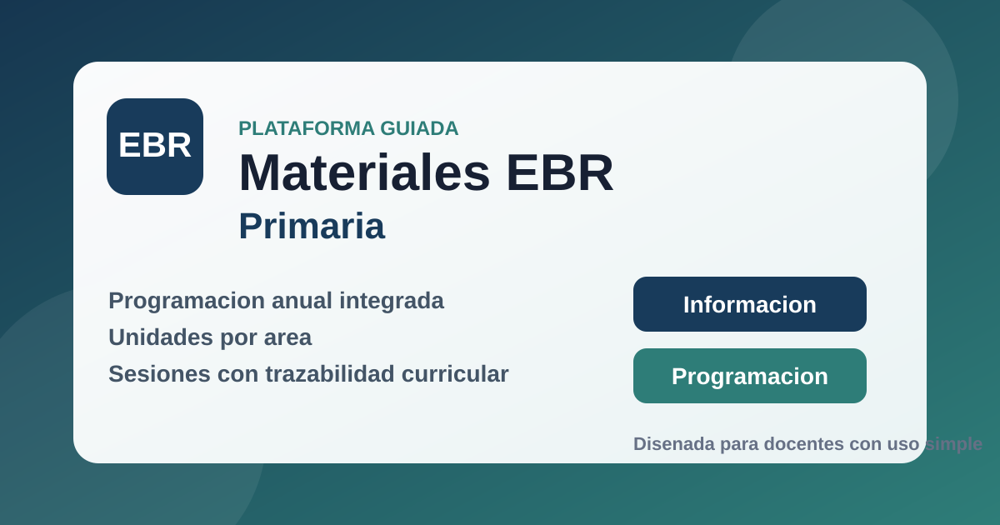

# Materiales EBR - Primaria

Generador guiado de programacion anual, unidades y sesiones para Educacion Primaria.

## Contenido

- `generador_ebr_primaria/index.html`: punto de entrada de la plataforma.
- `generador_ebr_primaria/assets/app.js`: logica de flujo, herencia y documentos.
- `generador_ebr_primaria/assets/styles.css`: interfaz e impresion.
- `generador_ebr_primaria/assets/curriculum.js`: motor curricular cargado en navegador.
- `generador_ebr_primaria/data/curriculum.json`: copia estructurada de la base curricular.

## Uso rapido

1. Abre `generador_ebr_primaria/index.html` en un navegador moderno.
2. Completa la seccion `Informacion` o carga una programacion existente.
3. Genera y valida la programacion anual.
4. A partir de ella, desarrolla unidades y sesiones.

## Nota

- La plataforma guarda avances en `localStorage`.
- En la seccion `Informacion` ahora existe el boton `Limpiar contenido anterior` para reiniciar una nueva generacion sin arrastrar datos previos.
